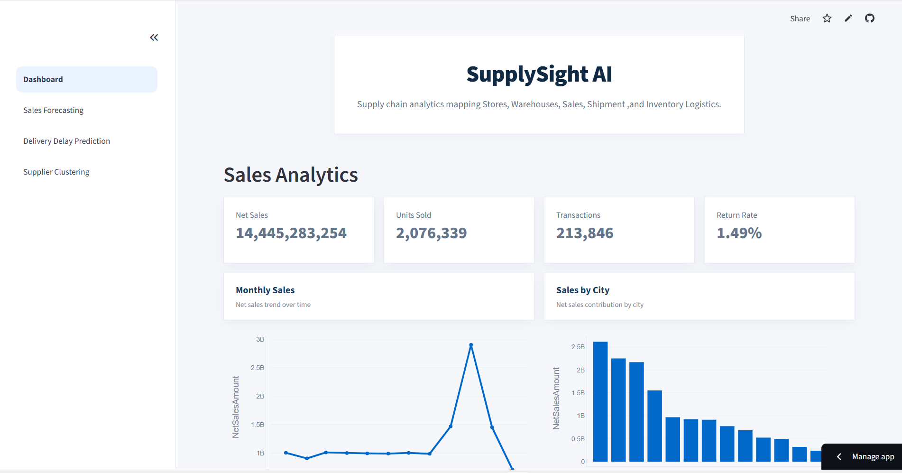
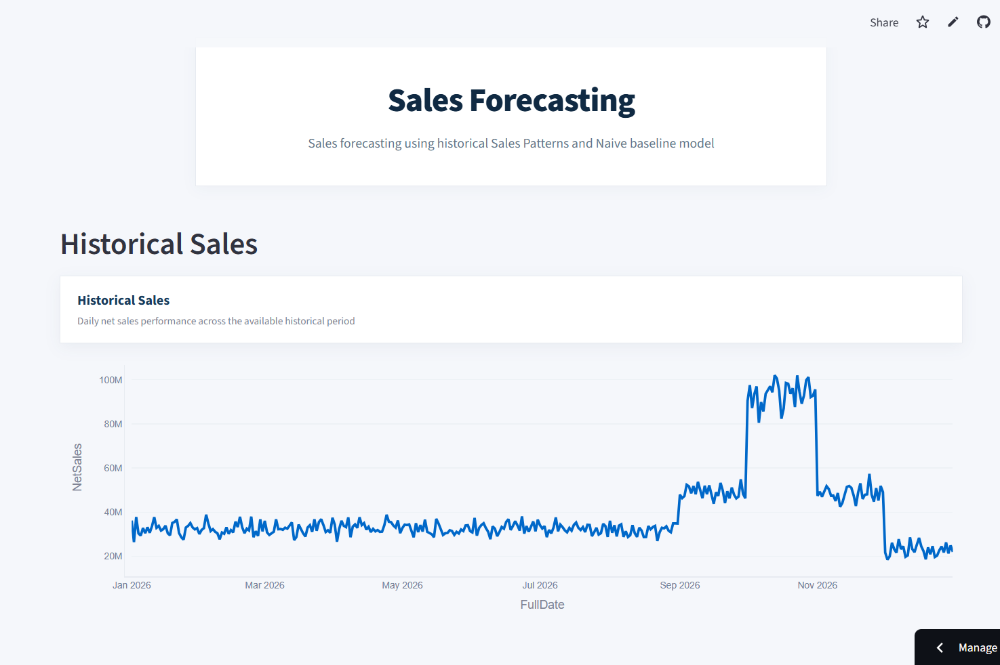
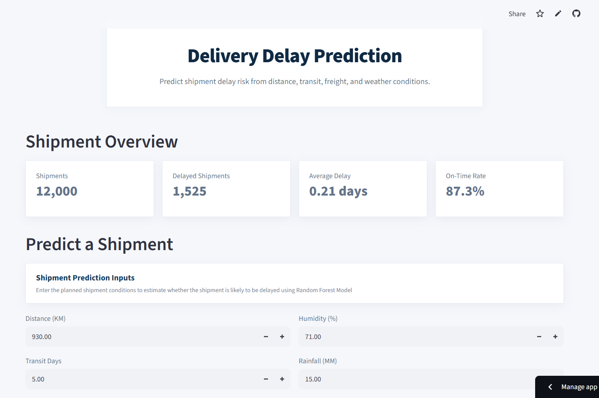
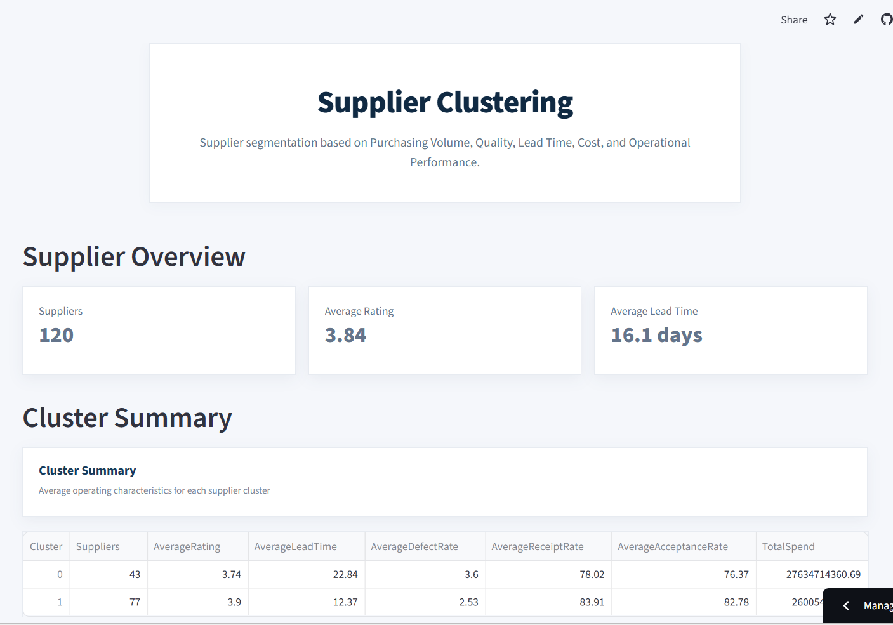

# SupplySight AI

**Supply Chain Analytics and Machine Learning Decision Support System**

SupplySight AI is a supply chain analytics project that integrates **Data Preprocessing, Data Warehousing, Exploratory Data Analysis, Machine Learning, and Interactive Application** development into a single workflow.

The system models four core supply chain functions: **Sales, Procurement, Inventory, and Shipment Logistics**, and uses operational data to generate business insights and support predictive decision-making.

---
## Application Overview
**Live Application:** [SupplySight AI](https://supply-sight-ai.streamlit.app/)

**Application Preview:**

<p align="center">
  
</p>

<p align="center">
  
  
  
</p>

---

## Project Overview

Supply chain operations generate data across multiple interconnected functions. SupplySight AI brings these functions together to support:

* Business intelligence and KPI analysis
* Sales forecasting
* Delivery delay prediction
* Supplier segmentation

The complete pipeline is:

```text
Data Cleaning & Validation
      ↓
MySQL Database 
      ↓
Data Marts & Analytical Views
      ↓
Python Exploratory Data Analysis
      ↓
Feature Engineering
      ↓
Machine Learning
      ↓
Streamlit Interactive Application
```

---

## Objectives

The project aims to:

1. Establish a structured and interconnected supply chain dataset for analysis.
2. Establish a SQL-based analytical layer for data transformation and KPI computation.
3. Identify operational patterns and relationships through exploratory data analysis on sales, procurement, inventory, logistics, supplier, warehouse, and store data.
4. Utilize machine learning models for forecasting, classification, and supplier segmentation.
5. Integrate analytical and ML outputs into an interactive decision support application.
   
---

## Data Sets

The project uses **synthetically generated data** designed to represent an interconnected supply chain environment. The datasets were designed around related business entities and processes and generated as CSV files using Python.

The data covers:

* Products
* Suppliers
* Stores
* Warehouses
* Sales
* Purchase Orders
* Inventory
* Shipments
* Logistics
* Weather

Synthetic data was used to provide control over relationships between entities and enable development of a complete cross-domain supply chain workflow.

---

## Data Preparation

The generated datasets were loaded into the MySQL database and cleaned. 

Key preparation steps included:

* Missing-value handling
* Duplicate detection and removal
* Data type standardization
* Referential consistency checks
* Identifier validation
* Derived feature creation

The objective was to establish a consistent dataset before moving to the analytics step.

---

## SQL Data Warehouse

The cleaned datasets were loaded into **MySQL** and organized into analytical tables, views, and data marts.

SQL was used for:
* Data cleaning and transformation
* Table creation
* Multi-table joins
* Aggregation
* KPI computation
* Analytical views
* Data marts

Four analytical data marts were created:

| Data Mart            | Analytical Focus                                                 |
| -------------------- | ---------------------------------------------------------------- |
| **Sales Mart**       | Sales performance, revenue, products, stores, and trends         |
| **Procurement Mart** | Purchase orders, suppliers, lead times, and supplier performance |
| **Inventory Mart**   | Inventory levels, stock movement, and warehouse performance      |
| **Logistics Mart**   | Shipments, delivery performance, lead times, and delays          |

---

## Exploratory Data Analysis

Python was used to analyze the SQL data marts and investigate patterns relevant to supply chain operations.

### Sales Analysis

* Daily and monthly sales trends
* Gross sales, net sales, units sold, returns, and return rate
* Store and geographic performance
* Product category, subcategory, and brand performance
* Discount and net-sales relationships

### Procurement Analysis

* Supplier performance metrics
* Supplier ratings, defect rates, receipt rates, and acceptance rates
* Supplier size and tier performance
* Supplier rating versus defect rate
* Procurement quantities and fulfillment volumes
* Procurement cost and average unit cost

### Inventory Analysis

* Current, reserved, and available inventory
* Stock utilization and coverage
* Warehouse distribution and performance
* Inventory levels by product category
* Inventory condition
* Reorder-level sufficiency
* Inventory risk indicators

### Logistics Analysis

* Shipment status and delay distributions
* Average delivery delay and on-time performance
* Weather severity and shipment delays
* Transport mode and delivery performance
* Freight cost and shipment distance
* Freight cost per kilometer

### Cross-Domain Analysis

Supplier and logistics data were combined to investigate:

* Supplier rating and delivery delay
* Supplier defect rate and delivery performance
* Supplier-level procurement and logistics performance

The analysis was used to identify **relevant features** and **business questions** for the machine learning stage.

**[View all analysis graphs → Analysis_Graphs.md](Analysis_Graphs.md)**

---

## Machine Learning

Three machine learning applications were developed for different supply chain decision problems:

1. Sales forecasting
2. Delivery delay prediction
3. Supplier segmentation

### 1. Sales Forecasting

**Objective:** Forecast daily Net Sales using historical sales patterns and calendar information.

### Workflow

```text
Historical Sales
      ↓
Daily Aggregation
      ↓
Time-Series Feature Engineering
      ↓
Chronological Train/Test Split
      ↓
Model Training
      ↓
Prediction & Evaluation
```

### Models Evaluated

* Naive Lag-1 baseline
* Linear Regression
* Random Forest Regressor
* Gradient Boosting Regressor

### Evaluation Metrics

* MAE
* RMSE
* R²
* MAPE

### Results

Gradient Boosting achieved the strongest performance among the machine learning models with an **R² of 0.77**. However, the **Naive Lag-1 baseline achieved the best MAPE at 13.67%**, outperforming the ML models on this metric.

Therefore, the **Naive Lag-1** approach was selected as the **final forecasting method**.

**Key Insight:** The result highlights the importance of baseline comparison when evaluating forecasting models.

---

### 2. Delivery Delay Prediction

**Objective:** Predict whether a shipment will be delivered on time or experience a delay.

### Workflow

```text
Shipment Data
      ↓
Feature Engineering
      ↓
Missing-Value Handling
      ↓
Categorical Encoding
      ↓
Train/Test Split
      ↓
Feature Scaling
      ↓
Classification
      ↓
Evaluation
```

### Models Evaluated

* Logistic Regression
* Random Forest Classifier

### Evaluation Metrics

* Accuracy
* Precision
* Recall
* F1-score
* Confusion Matrix
* Classification Report

### Model Selection

Random Forest achieved **92.17% overall accuracy**, but its default threshold detected only around **62% of delayed shipments**.
Logistic Regression with balanced class weights achieved **71% recall for delayed shipments** and **0.62 F1-score for the delayed class**

Logistic Regression was therefore selected as the preferred model.

**Key Insight:** Since identifying potential shipment delays is the primary business objective, **recall for the delayed class** was prioritized over **overall accuracy**.

---

### 3. Supplier Segmentation

**Objective:** Segment suppliers using procurement performance, cost, quality, and logistics characteristics.

### Workflow

```text
Procurement + Logistics Data
      ↓
Supplier-Level Aggregation
      ↓
Feature Engineering
      ↓
Standardization
      ↓
K-Means Clustering
      ↓
Cluster Profiling
      ↓
Business Interpretation
```

Procurement and logistics information were combined to create a broader supplier performance profile.

### Model

**K-Means clustering (K = 2)**

### Cluster 0: Core/Efficient Suppliers

**95 suppliers (79.2%)**

Compared with the overall supplier average:

* ~17% lower lead time
* Approximately average defect rate
* ~4% higher average delay
* ~20% higher average order quantity
* ~21% lower average cost per order

**Interpretation:** This group is characterized by larger orders, lower costs, and shorter lead times.

### Cluster 1: Specialized/Higher-Cost Suppliers

**25 suppliers (20.8%)**

Compared with the overall supplier average:

* ~65% higher lead time
* ~2% higher defect rate
* ~17% lower average delay
* ~75% smaller average order quantity
* ~80% higher average cost per order

**Interpretation:** This group is characterized by smaller, higher-cost orders and substantially longer lead times, while exhibiting lower average delivery delays.

**Key Insight:** The clustering identifies distinct supplier profiles rather than assigning suppliers tiers for better/worse.

---

## Machine Learning Summary

| Problem                       | Final Approach      | Key Result                                     |
| ----------------------------- | ------------------- | ---------------------------------------------- |
|   Sales Forecasting           | Naive Lag-1         | MAPE = **13.67%**                              |
|   Delivery Delay Prediction   | Logistic Regression | **71%** delayed-shipment recall, F1 = **0.62** |
|   Supplier Segmentation       | K-Means (K=2)       | **95 core**, **25 specialized** suppliers      |

For sales forecasting, Gradient Boosting produced the strongest ML-model R² (**0.77**), but the Naive Lag-1 baseline achieved better MAPE and was therefore selected for the final forecasting approach.

---

## Streamlit Application

The final analytical and machine learning components are integrated into an interactive **Streamlit application**. It consists of following pages:

* **Dashboard:** It contains four page sections corresponding to the four SQL data marts:
  * Sales
  * Procurement
  * Inventory
  * Logistics
* **Sales Forecasting:** Provides an interface for generating and viewing sales predictions.
* **Delivery Delay Prediction:** Allows users to input relevant shipment information and obtain a predicted delivery delay outcome.
* **Supplier Clustering:** Provides an interactive view of supplier segments generated by the clustering model.

---

## Tools & Technologies Used
* Programming Language: Python
  * Data Manipulation and Analysis: Pandas, NumPy
  * Visualization: Matplotlib, Seaborn, Plotly
  * Machine Learning: Scikit-learn
* Database: MySQL   
* Application interface: Streamlit
* Version Control: Git, GitHub  
---

# Project Architecture

```text
                         SUPPLYSIGHT AI
                              │
                              ▼
                  Data Cleaning & Validation
                              │
                              ▼
                       MySQL Database
                              │
                 ┌────────────┼────────────┐
                 │            │            │
                 ▼            ▼            ▼
               Tables      Data Marts   SQL Views
                 │            │            │
                 └────────────┼────────────┘
                              │
                              ▼
                       Python Analytics
                              │
                 ┌────────────┴────────────┐
                 │                         │
                 ▼                         ▼
             EDA / KPIs              Machine Learning
                                           │
                              ┌────────────┼────────────┐
                              │            │            │
                              ▼            ▼            ▼
                           Sales       Delivery      Supplier
                         Forecasting      Delay       Clustering
                              │            │            │
                              └────────────┼────────────┘
                                           │
                                           ▼
                                Streamlit Application
                                           │
                                           ▼
                               Decision Support Interface
```

---

# Future Improvements

Potential extensions include:
* Automated data ingestion
* Shipment anomaly detection
* Advanced time-series forecasting
* Inventory stock-out prediction
